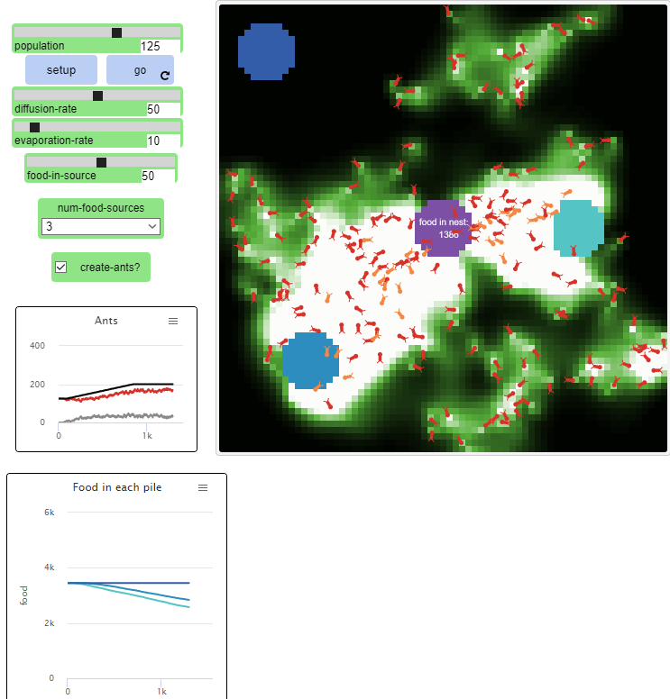

## Комп'ютерні системи імітаційного моделювання
## СПм-23-4, **Кононенко Анастасія Ігорівна**
### Лабораторна робота №**2**. Редагування імітаційних моделей у середовищі NetLogo

 

### Варіант 10, модель у середовищі NetLogo:
[Ants](http://www.netlogoweb.org/launch#http://www.netlogoweb.org/assets/modelslib/Sample%20Models/Biology/Ants.nlogo)

 

### Внесені зміни у вихідну логіку моделі, за варіантом:

**Додана функція вибору кількості джерел їжі на полі** 

Було модифіковано процедуру setup-food. Тепер кількість створених джерел їжі залежить від значення селектора: при низьких значеннях деякі джерела їжі не генеруються.
<pre>
 to setup-food  ;; patch procedure
  ;; setup food source one on the right
  if (distancexy (0.6 * max-pxcor) 0) < 5 and num-food > 0
  [ set food-source-number 1 ]
  ;; setup food source two on the lower-left
  if (distancexy (-0.6 * max-pxcor) (-0.6 * max-pycor)) < 5 and num-food > 1
  [ set food-source-number 2 ]
  ;; setup food source three on the upper-left
  if (distancexy (-0.8 * max-pxcor) (0.8 * max-pycor)) < 5 and num-food > 2
  [ set food-source-number 3 ]
  ;; set "food" at sources to either 1 or 2, randomly
  if food-source-number > 0
  [ set food one-of [1 2] ]
end
</pre>

Був доданий селектор для налаштування кількості джерел їжі:

**Додана функція обмеження появи нових мурах залежно від рівня їжі у гнізді**

Зміни в процедурі go: при наявності понад 10 одиниць їжі в гнізді кожні 10 тіків може з'явитися нова мураха, що "коштує" 1 одиницю їжі.
<pre>
to go  ;; forever button
  ...
  if collected-food > 10 and ticks mod 20 = 0 and count turtles < 200 and create-ants?[
   set collected-food collected-food - 1
   create-turtles 1
  [ set size 2         ;; easier to see
    set color red  ]
  ]
...
end
</pre>

Був доданий перемикач для активації або деактивації створення мурах:

                  
**Додано індикатор зібраної їжі у гнізді:**

Додана змінна для підрахунку їжі, яку принесли в гніздо:
<pre>
  collected-food
 </pre>

Процедуру go було доповнено для відображення кількості їжі в гнізді:
<pre>
to go  ;; forever button
  ...
  ask patch 4 1 [set plabel "food in nest:"] 
  ask patch 1 -1 [set plabel collected-food]
  ...
end
</pre>

Процедура return-to-nest також змінена. Коли мураха приносить їжу в гніздо, кількість їжі збільшується на 1:
 <pre>
to return-to-nest  ;; turtle procedure
  ifelse nest?
  [ 
   ...
    set collected-food collected-food + 1
    rt 180 ]
   ...
end
</pre>

**Доданий графік для відстеження кількості мурах**

На графіку відображено:
- Чорний - загальна кількість мурах.
- Червоний - мурахи, що шукають їжу.
- Жовтий - мурахи, які знайшли їжу та повертаються до гнізда.

### Внесені зміни у вихідну логіку моделі, на власний розсуд:

**Кількість їжі в джерелах**
Замість випадкової кількості одиниць їжі на кожному патчі тепер можна задати її через слайдер, який визначає фіксоване значення. Модифіковано процедуру setup-food:
<pre>
to setup-food  ;; patch procedure
  ;; setup food source one on the right
  if (distancexy (0.6 * max-pxcor) 0) < 5 and num-food-sources > 0
  [ set food-source-number 1 ]
  ;; setup food source two on the lower-left
  if (distancexy (-0.6 * max-pxcor) (-0.6 * max-pycor)) < 5 and num-food-sources > 1
  [ set food-source-number 2 ]
  ;; setup food source three on the upper-left
  if (distancexy (-0.8 * max-pxcor) (0.8 * max-pycor)) < 5 and num-food-sources > 2
  [ set food-source-number 3 ]
  ;; set "food" at sources to either 1 or 2, randomly
  if food-source-number > 0
  [ set food food-in-source ]
end
</pre>

**Феромони**
Тепер мурахи виділяють невелику кількість феромонів, навіть якщо ще не знайшли їжу (в 15 разів менше, ніж при знаходженні їжі). Це сприяє їхньому згрупованому руху, однак трохи знижує ефективність збору їжі.
<pre>
 to look-for-food  ;; turtle procedure
  if food > 0
  [ set color orange + 1     ;; pick up food
    set food food - 1        ;; and reduce the food source
    rt 180                   ;; and turn around
    stop ]
  ;; go in the direction where the chemical smell is strongest
  if (chemical >= 0.05) and (chemical < 2)
  [ uphill-chemical ]
  set chemical chemical + 4
end
</pre>

Фінальний код моделі та її інтерфейс доступні за [посиланням](Ants.nlogo). 
 

## Обчислювальні експерименти
### 1. Вплив кількості мурах (POPULATION) на ефективність збору їжі
Досліджується залежність ефективність пошуку та збору їжі з трьох джерел (куч) протягом певної кількості тактів (500) від кількості мурах у колонії, зазначеного на початку симуляції.
Експерименти проводяться при 20-200 мурах, з кроком 20, усього 10 симуляцій. 

Інші керуючі параметри мають значення за замовчуванням:
- **diffusion-rate**: 50
- **evaporation-rate**: 50
- **food-in-source**:10
- **num-food-sources**:3
- **create-ants?**:on
  
На початку кожної симуляції у всіх джерелах усього 2070 одиниць їжі.
<table>
<thead>
<tr><th>Кількість мурах</th><th>Кількість їжі у джерелах</tr>
</thead>
<tbody>
<tr><td>20</td><td>2056</td></tr>
<tr><td>40</td><td>2051</td></tr>
<tr><td>60</td><td>1998</td></tr>
<tr><td>80</td><td>1936</td></tr>
<tr><td>100</td><td>1955</td></tr>
<tr><td>120</td><td>1964</td></tr>
<tr><td>140</td><td>1840</td></tr>
<tr><td>160</td><td>1936</td></tr>
<tr><td>180</td><td>1746</td></tr>
<tr><td>200</td><td>1702</td></tr>
</tbody>
</table>

Графік наочно показує, що зі збільшенням популяції мурах у колонії зменшується кількість залишеної їжі в джерелах, що свідчить про підвищення ефективності збору ресурсів. Однак, починаючи з 100 мурах, подальше зростання кількості мурах не призводить до значного покращення результатів.